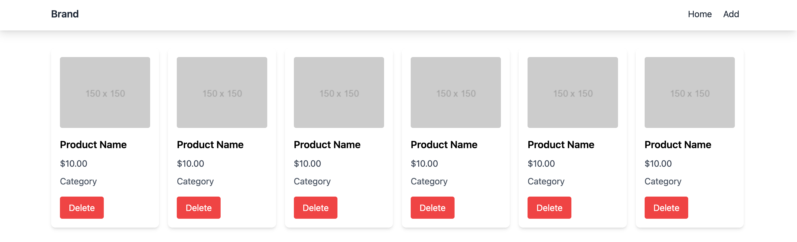
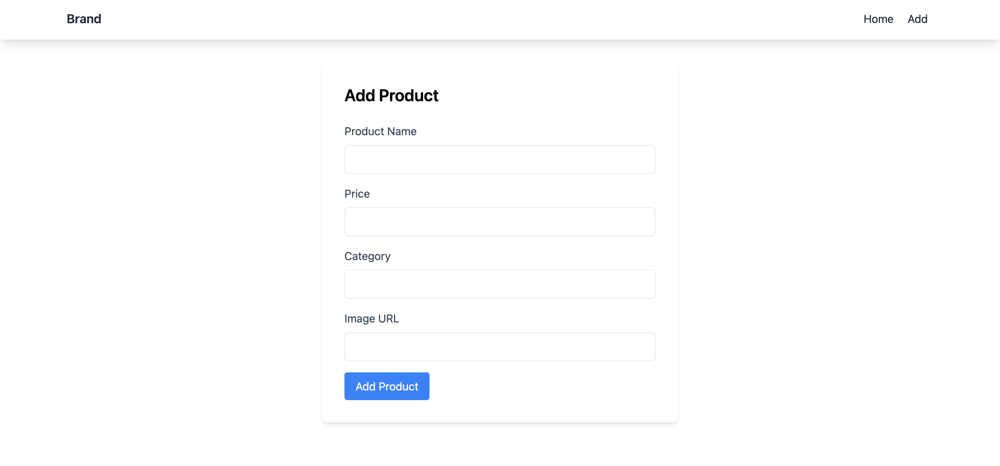

# FERN-P2-S1LC02 - Hacktiv Grocery

## Ringkasan

Kali ini, Kalian sedang menjadi seorang frontend dan ditugaskan untuk membuat aplikasi client-side bernama `Hacktiv Grocery`, sebuah aplikasi untuk membantu mengatur list grocery kalian. Feature utama dari aplikasi ini adalah:

Semoga sukses!

## Aturan & Kebijakan

-   Waktu Pengerjaan: **150 min**
-   Rubric score terdapat pada setiap release dan bisa dikerjakan secara acak (tidak harus diselesaikan secara berurutan), lakukan strategi yang tepat agar mendapatkan score maksimal!
-   Student diharapkan menjunjung tinggi INTEGRITAS. Segala bentuk ketidakjujuran meliputi peniruan, plagiarisme, pemalsuan pengerjaan akan mendapatkan tindakan tegas dari akademik

## Bobot Penilaian

-   Basic Web Development (10)
-   CSS Styling & Layouting (15)
-   Basic JS syntax & flow (10)
-   API Integration (30)
-   UI Library (React.js) (25)
-   State Management (10)

## Components

Buatlah client side kalian yang terdiri dari beberapa component-component berikut:

-   Home Page
    -   Grocery Card
-   Add Grocery Page

## Release 0 - Setup Project (10)

Lakukan setup project dengan menginstall package yang sudah diajarkan sebelumnya yaitu vite, react.js, react-router dan firestore sebagai backend untuk mengelola CRUD (Create, Read, Update, Delete). Pada project ini terdapat assets sebagai referensi tampilan web yang diharapkan. Gunakanlah template yang sudah disediakan pada project ini.

## Release 1 - Home Page (Fetch Groceries) (30)

-   Buatlah route `/` untuk menampilkan list grocery di client
-   Buatlah Card untuk menampilkan detail dari Grocery dan tambahkan tombol `Delete` pada setiap Card Grocery yang ada
-   Terapkan konsep component untuk setiap bagian yang bersifat `reuseable`

## Release 2 - Add Grocery (27.5)

-   Buatlah route `/add-grocery` untuk menampilkan Form Add Grocery di client
-   Integrasikan tombol `Add` pada halaman Home ke halaman Add Grocery
-   Jika berhasil melakukan Add Grocery, user akan diredirect ke halaman Home `/`
-   Jika berhasil Add Grocery maka list grocery akan bertambah tanpa harus di refresh (Pastikan website kalian reaktif)

## Release 3 - Delete Grocery (22.5)

-   Pada halaman Home, Integrasikan tombol `Delete` pada list grocery
-   Jika berhasil Delete Grocery maka list grocery user akan berkurang tanpa harus di refresh (Pastikan website kalian reaktif)

## Release 4 - State Management (10)

Gunakan State Management untuk melakukan fetching data & menyimpan data pada state menggunakan react-redux
